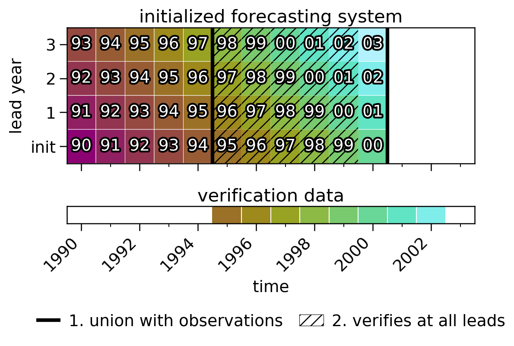

**********************
Verification Alignment
**********************

A forecast is verified by comparing a set of initializations at a given lead to
observations over some window of time. However, there are a few ways to decide *which*
initializations or verification window to use.

One can pass the keyword ``alignment=...`` to any compute functions (e.g.,
:py:func:`~climpred.prediction.compute_persistence`,
:py:func:`~climpred.prediction.compute_hindcast`,
:py:meth:`~climpred.classes.HindcastEnsemble.verify`) to change the behavior for
aligning forecasts with the verification product.

The available keywords are:

*  ``'same_init'`` (current default): Use a common set of initializations that verify
   across all leads. This ensures that there is no bias in the result due to the state
   of the system for the given initializations.

*  ``'same_verif'``: Use a common verification window across all leads. This ensures that
   there is no bias in the result due to the observational period being verified
   against.

*  ``'maximize'``: Use all available initializations at each lead that verify against
   the observations provided. This changes both the set of initializations and the
   verification window used at each lead.

Same initializations
####################

(**current default**)

.. code::

    ``alignment='same_inits'``

Below is an example of the logic used in ``climpred`` to select initializations that
verify with the given verification data over all leads.

Here we have an initialized forecasting system with annual initializations from 1990
through 2000 and three lead years. We are verifying it against a product that spans 1995
through 2002.

Two conditions must be met to retain the initializations for verification:

1. All forecasted times (i.e., initialization + lead year) for a given initialization
   must be contained in the verification data. Schematically, this means that there must
   be a union between a column in the top panel and the time series in the bottom panel.
   The 2000 initialization below is left out since the verification data does not
   contain 2003.

2. There must be an observation in the verification data for the given initialization.
   In combination with (1), initializations 1990 through 1994 are left out. This logic
   exists so that any `reference forecasts <reference_forecast.html>`__
   (e.g. a persistence forecast) use an identical set of initializations as the
   initialized forecast.

